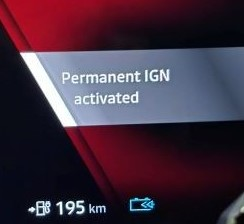

# How to for Renault Scenic ETECH 100% electric

This is a list of non-obvious stuff one needs to remember to not have to search
inside the manual all the time.

## Car features while driving

*How do I set the speed when driving?*

If you have turned off the most advanced functions for assistance, you can still
use the Speed Sign Button on the left side of your steering wheel to set the
cruise control to the current speed limit.

*How do I wipe the windows just one time to get rid of some drops?*

Push the window wiper stalk upwards one time and let go.

## Car features when parked

*How do I park the window wipers in upright position?*

Power on, but engine off. Then push the window wiper stalk upwards two times.

*How do I keep the ventilation on for a long time?*

Power on, but engine off. Apply parking brake. Set gear in N(eutral). Long press
start without touching the brake. You then enter "Permanent IGN" (ignition)
mode, which does should not time out after a short period.

## Charging issues

*How do I pre-condition (pre-heat) the traction battery before charging?*

You have to navigate **VIA** a charger. If you didn't plan the route, you will
need to add a stop after the charger you are navigating to. It can be close by.
Renault assumes that you will have plenty of time to charge at your destination,
so no pre-conditioning will be started unless it is a via-point. You will get no
indication that pre-heating is actually in effect. Let us hope Renault gives us
a manual override button and some sign that it is in effect.

## Multi media issues while parked

*Stuff doesn't work as I expect, what do I do?*

Reboot the multi media system. Just like Android Phones, some times, a reboot
will solve an issue, and it is reasonably quick. Keep your finger on the power
button for a while, and you get the option to restart the system.

*The volume buttons only moves the mic volume up and down, what do I do?*

Restarting the multi media system will resolve that issue.
