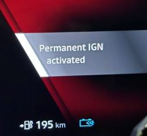

# Hvordan fikse ting i Renault Scenic ETECH 100% electric

Dette er en liste over ikke-åpenbare ting som er kjekt å vite om bilen.

## Ting man kan gjøre når man kjører

*Hvordan sette kruskontrollen når jeg kjører?*

For å holde farten du har, trykk oppoverpil, så holder farten seg. Om du ikke
har stilt inn automatisk endring av fartsgrense, så kan du bruke
trafikk-skilt-knappen for å gå rett til gjeldende fartsgrense.

*Hvordan kjøre vindusviskerne kun en gang for å bli kvitt dråper på ruta?*

Skyv vindusviskerhendelen oppover og slipp, så kjører vindusviskerne en gang.

## Ting man kan gjøre når parkert

*Hvordan parkerer jeg vindusviskerne i oppoverposisjon?*

Bilen må være slått på, men "tenningen" av. Skyv vindusviskerhendelen opp og
slipp to ganger i rask rekkefølge. Kjekt om man skal rense eller bytte
vindusviskere, eller er bekymret for fast-ising på vinteren.

*Hvordan hindrer jeg klimasystemet å slå seg av når jeg skal sitte lenge i bilen?*

Bilen må være slått på, men "tenningen av". Håndbrekk på (viktig). Sett giret i
N(øytral). Press på tenningsknappen og hold den inne til det står "Permanent
IGN".

*Hvordan åpner jeg bagasjerommet med knappen på dashboardet*

Trykk ned (eller dra opp) knappen og slipp den umiddelbart når pipet høres. Det
er ganske merkelig at det er slik, vi får håpe Renault fikser dette i firmware.

## Lading

*Hvordan sørger jeg for at bilen har forvarmet batteriet før hurtiglading?*

Du må navigere **VIA** en hurtiglader med bilens egen Google Maps-app. Du kan
ikke bruke Android Auto-versjonen. Du kan ikke navigere direkte til en lader,
men det går fint at siste destinasjon er nære. Om bilen tror du er på vei til å
parkere på en lader, ser den ikke noe poeng i å forvarme. Du får ingen
indikasjon på om bilen faktisk forbereder seg på lading eller ikke. La oss håpe
Renault fikser dette. Og at vi får en manuell knapp for å forvarme batteri.

## Multimediasystemet

*Multimediasystemet oppfører seg rart, hva gjør jeg?*

Omstart systemet, akkurat som man gjør med mobilen en gang i blant, systemet er
jo tross alt Android. Det gjøres ved å holde fingeren på den store av/på-knappen
til høyre for skjermen inntil skjermen blir svart. Deretter omstarter systemet.

*Volumkontrollen endrer kun mikrofon-nivået, ikke lyden, hva gjør jeg?*

Dette er en bug som oppstod i vår bil ved et tilfelle. Ble løst av en omstart
(se over).
